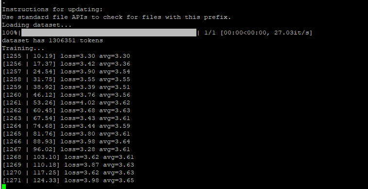

# GPT2 Easy Text Generation

## Fine Tune GPT2 Easily. Generate your ows text.

This custom based fine tuning of GPT-2 ist based on ["Beginner’s Guide to Retrain GPT-2 (117M) to Generate Custom Text Content"](https://medium.com/@ngwaifoong92/beginners-guide-to-retrain-gpt-2-117m-to-generate-custom-text-content-8bb5363d8b7f) proposed by Ng Wai Foong. For detailed description check his awesome blog. 

### Clone Github repository

### Use terminal to navigate to the folder

### Install requirements

```
pip install -r path/to/requirements.txt
```

### In the "src" folder open the "models" folder:

Folder "117M" contains the GPT-2 model containing the following files: 

1. checkpoint
2. encoder.json
3. hparams.json
4. model.ckpt.data-00000-of-00001
5. model.ckpt.index
6. model.ckpt.meta
7. vocab.bpe

Folder "shakespeare" contains the custom fine tuned model.

### Instruction how to fine tune own model.

### 1. Prepare you .txt data.

You can use any kind of text data that you can find as long as they are in English. 
You can put all text into one text file or save them in multiple text files in one directory. 

If you use one text file, separate each text with: 

```
<|endoftext|>
```
### 2. Navigate to the "src" folder and save the text or folder 

I used the texts of Shakespeare and saved them as shakespeare.text.

### 3. Encode the texts

```
python encode.py shakespeare.txt shakespeare.npz
```

### 4. Train GPT-2

```
python train.py --dataset shakespeare.npz 
```



In progress...
